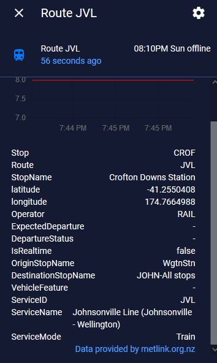

[](https://opensource.org/licenses/MIT)

[*](https://icons8.com/icons/set/bus)   [*](https://icons8.com/icons/set/train)    [*](https://icons8.com/icons/set/water-transportation)  
  
  # **Metlink Wellington Home Assistant**
  
  Version 1.0 
  
## **A Home Assistant transport sensor for the Wellington Regional Transport Network.** 

Metlink Wellington Home Assistant is a custom component for Home Assistant, that provides a transit sensor for a Metlink Wellington bus stop, train station, or ferry wharf. The sensor will display the next departure time or the mins until the next departure from a given Metlink location for a selected route. Minutes are displayed when the departure is real time, and times are displayed when the departure is scheduled but realtime information is not available because the next service has not commenced from its starting location. 

The sensor returns no information if no departure for the stop and route is found. 

Below are some pictures of the sensor in operation in Home Assistant. 

## Sensor RTI (real time info) arrival in minutes of the next train at the station


## Sensor scheduled (offline) expected arrival time of the next train at the station 




## Home Assistant Sensor Attributes

Attributes of the sensor (which you could use in a lovelace card or with a template in Home Assistant) are as follows:

Attribute | Explanation
------------ | -------------
Stop | The number or ID for the stop/station/wharf
Route | The number or ID for the route (service)
StopName | The name of the stop
Latitude | Latitude for the location of the stop/station/wharf
Longitude | Longitude for the location of the stop/station/wharf 
Operator | The business operating the service e.g. RAIL or a bus company 
ExpectedDeparture |  Time and day the next service is expected to depart from the location (real time service only)
DepartureStatus | Displays whether the service is on time or there is a delay from the expected time (real time service only)
IsRealTime | Displays true if the info is realtime, otherwise is blank
OriginStopName | The location from where the service commences the route
DestinationStopName | The location where the service will finish the route
VehicleFeature | Displays any special features of the service e.g. a bus that can drop low to allow a wheelchair to enter
ServiceID | The number or ID for the route (service)
ServiceName | The name of the route (service)
ServiceMode | Whether the service is a bus, train, or ferry

### Configuration:

From the [Metlink](https://www.metlink.org.nz/) website determine the exact stop and route number/ID to enter in the configuration for your desired location and route.

You can obtain train station abbreviation codes (which are used as the stop_number for a train station) from  https://www.metlink.org.nz/getting-around/real-time-information/

Then add the data to your configuration.yaml file as shown in the example:

#### Example configuration.yaml entry

```
sensor:
  - platform: metlink
    stop_number: a stop number or station/wharf id
    router_number: a router number or route id
```
Each configured location (stop/station/wharf) will appear on your map in Home Assistant.  

### Configuration Variables:

Variable | Type | Required | Explanation
------------ | ------------- | ------------- | -------------
stop_number | string | Yes | The number or ID for the stop/station/wharf
route_number | string | Yes | The route number/id for the route (service)

### Configuration Examples:

A full configuration example could look like this:

This is the Willis Street Grand Arcade bus stop (stop 5008). Three routes that stop at this location have been configured. This will result in three sensors appearing in Home Assistant.  

```
sensor:
  - platform: metlink
    stop_number: 5008
    route_number: 2
  - platform: metlink
    stop_number: 5008
    route_number: 14
  - platform: metlink
    stop_number: 5008
    route_number: 52
```

## Credit

Based on the research of @reedwade https://github.com/reedwade/metlink-api-maybe and initial code of @Br3nda https://github.com/Br3nda/metlink-wellington-homeassistant. 
